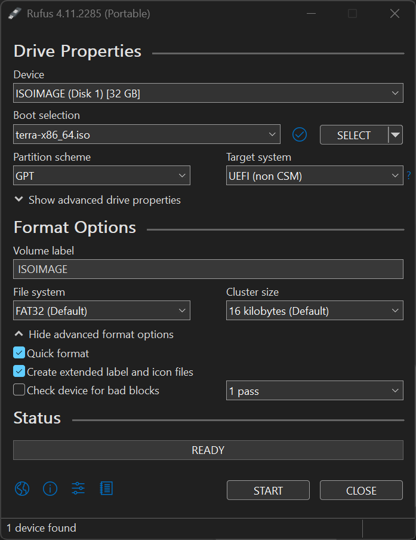
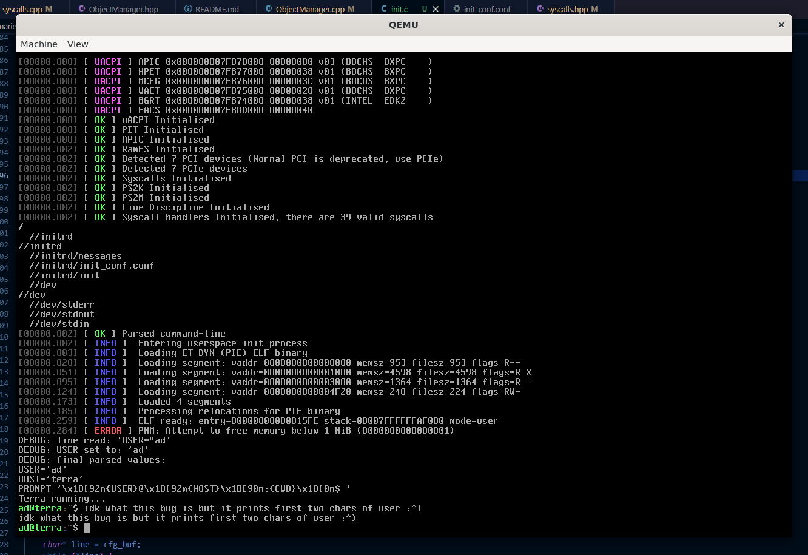

# The Terrakernel Project
## Made for Terra

Terrakernel is a hybrid x86_64 kernel.

During the development of TK the kernel will always be on version v1.0-rc1.
Terra is the operating system I'm planning to use terrakernel for.

# TODO
*: WIP

### Initial stuff
- [x] Port printf implementation
- [x] Support for some COM1 serial output using port 0x3F8
- [x] End of initial stuff

### x86_64 Specific
- [x] Write a GDT
- [x] Write an IDT
- [x] Write a physical memory manager
- [x] Write a virtual memory manager
- [x] Write a heap
- [x] Write a PIT timer (Unused now, use APIC)
- [x] Write an APIC and Multiprocessing support (no MP for now)
- [x] Write an APIC timer
- [x] Switch to fully graphical (flanterm) messages and logs
- [x] Port uACPI
- [x] (Other) Write a VFS and RamFS and parse a USTAR Initrd archive
- [x] Multiprocessing (kinda works cuz we can give CPUs a task)
- [ ] Scheduling and multithreading*
- [x] Switching to userspace
- [x] Write some basic syscalls
- [x] Load x86_64 ELF binaries, static and relocatable (copy from old version of TK) (delayed)
- [x] BGRT table
- [ ] End of x86_64 stuff (almost) (almost)

### Other
- [ ] Write a VFS and TMPFS and parse a USTAR Initrd archive
- [x] Write a PCI driver (PCIe as well)
- [x] Write a PS2 keyboard driver and PS2 mouse driver
- [x] Line discipline
- [ ] End of other

### Porting software
- [ ] Write or port a LibC
- [ ] Port binutils and coreutils
- [ ] Port DOOM
- [ ] Port a window manager (window server) (probably Xorg)
- [ ] Port anything else
- [ ] End of porting software
- [ ] End of project... or at least this version...

### Building the kernel
Check [BUILD_INSTRUCTIONS.md](https://github.com/Terrakernel-Project/Terrakernel/blob/master/BUILD_INSTRUCTIONS.md)

### How many LoC?

```x86asm
     265 text files.
     244 unique files.
       5 files ignored.

github.com/AlDanial/cloc v 1.98  T=1.89 s (128.8 files/s, 45417.2 lines/s)
-------------------------------------------------------------------------------
Language                     files          blank        comment           code
-------------------------------------------------------------------------------
C                               55           6546           4143          36419
C/C++ Header                   145           3474          11642          15373
C++                             37           1522             30           6601
Assembly                         5             40              0            236
CMake                            1              0              0             21
Markdown                         1              0              0              2
-------------------------------------------------------------------------------
SUM:                           244          11582          15815          58652 (58187 old / +465 lines)
-------------------------------------------------------------------------------
```

### Screenshots




